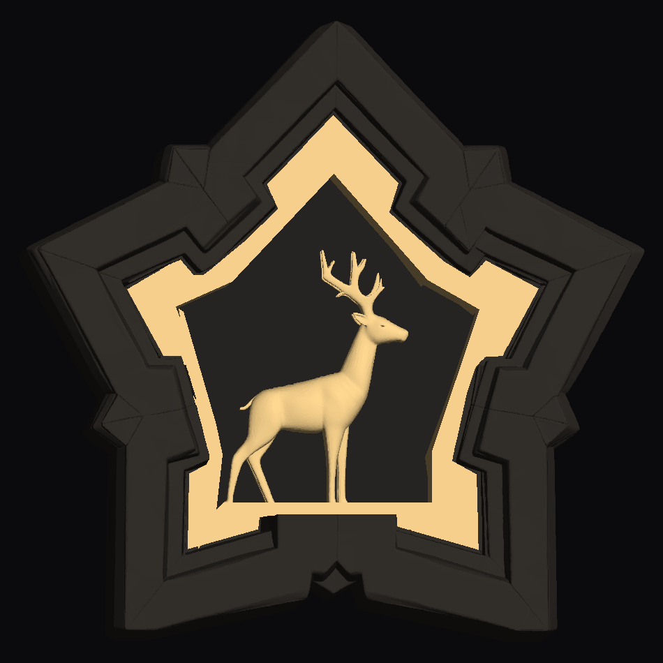

# Ciudadela / Starlit Stag — lámpara imprimible

Del OBJ de Meshy a **tres piezas** que se imprimen sin soportes y se montan con
cinco tornillos. Toda la geometría vista es **la del OBJ original**, extraída por
booleanas: ninguna superficie se reconstruye a mano.



## Las tres paredes

| pared | pieza | material |
|---|---|---|
| exterior, el marco de la estrella | `1_piedra` | opaco |
| **la iluminada**: la corona que rodea la boca del nicho | `2_luz` | **translúcido** |
| **el escalón interno** que baja hasta el fondo | `2_luz` | **translúcido** |
| la de detrás del ciervo | `3_tapa` (pedestal) | opaco |
| el ciervo, en relieve | `2_luz` | **translúcido** |

La pared iluminada se saca del propio modelo: es la corona plana a Z ≈ +9…+12 mm,
**4 098 mm², de 9,1 mm de ancho medio** (hasta 20 mm en las puntas). El escalón
interno son las cinco paredes del pozo, 23,9 mm de caída. El fondo del nicho no
emite: son **13,4 mm de opaco macizo**, y va montado en la tapa.

## Las tres piezas

| | filamento | tamaño | volumen |
|---|---|---|---|
| `1_piedra` | opaco, acabado piedra | 200 × 198 × 55 mm | 745 cm³ |
| `2_luz` | **translúcido** | 138 × 144 × 52 mm | 88 cm³ |
| `3_tapa` | opaco | 163 × 180 × 16 mm | 133 cm³ |

`2_luz` es **una sola pieza**: corona + escalón interno + ciervo + una **falda
exterior** que baja desde el borde de la corona hasta la tapa. Esa falda queda
oculta dentro de la piedra y hace tres cosas: le da a la corona en qué apoyarse
para imprimirse sin soportes, sitúa la pieza en el hueco, y forma la caja donde
va el LED (**42 cm² de planta × 32 mm de fondo**).

## El ciervo

Ya no flota con un tallo por detrás. Es un **relieve de 15 mm** que sale de la
pared del fondo: se recula 10,9 mm y se queda pegado a ella, conservando su
contorno exacto y los 15 mm delanteros de su modelado original. Por detrás no
queda nada: el hueco del ciervo desemboca directamente en un agujero con su
silueta (metida 2,5 mm, así que no se ve) en el pedestal de la tapa, y ahí es
donde va su trozo de tira LED.

## Medidas

| | |
|---|---|
| Estrella | 200 × 198 mm |
| Grosor | 55,1 mm + 3 mm de tapa = **58,1 mm** |
| Nicho | 23,9 mm de profundidad |
| Fondo del nicho | **13,4 mm de opaco** |
| Relieve del ciervo | 15 mm |
| Caja del LED | 42 cm² × 32 mm |
| Paredes translúcidas | 1,95 mm mínimo |

## Impresión

Las tres salen **en la orientación en la que están exportadas**, cara plana abajo
y todas las cavidades abriendo hacia arriba. Piedra y tapa, **sin soportes**.
La luz, **con soportes solo debajo del ciervo**: su relieve empieza 13,4 mm por
encima de la cama (10 islas entre Z −13,0 y −3,4). Los soportes tocan el lomo
trasero, que va contra el fondo y no se ve. Lo demás de la luz se puentea solo:
la primera capa de la corona es un puente de 10,9 mm entre el tubo y la falda.

- Boquilla 0,4 · capa 0,2 · **3 perímetros**.
- Piedra: relleno 10–15 %. Huella de 200 × 198 mm, comprueba que te cabe.
- Luz: **10 % de giroide y 3 perímetros** (0 % dejaría la corona sin sobre qué
  apoyar las capas de arriba).
- Tapa: 15 %.

La trasera de la estrella la he **aplanado 0,5 mm** para quitarle la textura de
Meshy: agarra la primera capa y la tapa asienta plana. Es la única cara tocada.

## Montaje

1. Mete `2_luz` **por detrás**, empujando hacia delante hasta que la corona
   asiente en su rebaje.
2. Pega la tira LED dentro de la caja de `2_luz`, sobre la tapa, y un trozo justo
   debajo del agujero del ciervo. Pasa el cable por la muesca del espigo.
3. Atornilla `3_tapa`: **5 × M3 × 10 autorroscantes de cabeza avellanada**
   (el avellanado de 90° abre hacia la cara de fuera y la cabeza queda
   enrasada), a taladros de Ø2,7 y 8 mm de fondo. Su pedestal es el fondo del nicho y, al apretar, deja la
   pieza de luz cogida contra su rebaje: no hace falta pegamento.
4. El cable baja por el canal de la trasera y sale por la muesca de entre los dos
   pies, a ras de mesa.

Comprobado moviendo cada pieza por **todo el recorrido** de montaje (1, 2, 4, 8,
16, 30 y 50 mm), no solo en la posición final: 0 mm³ de choque.

## Ficheros

```
preparar.py      genera las tres piezas desde el OBJ (parámetros arriba del todo)
verificar.py     24 comprobaciones + renders
geo.py           secciones horizontales en coordenadas mundo
render.py        rasterizador para los renders
1_piedra / 2_luz / 3_tapa   .stl y .ply
montada.3mf      las tres en su sitio, para mirarlo antes de laminar
```

## Comprobado (24/24)

- Las tres piezas cerradas, coherentes y de un solo trozo.
- Solape entre piezas: 0,00 mm³.
- Silueta exterior intacta (0,000 mm); 1 de 1 995 puntos de la superficie vista
  del original desviado más de 0,3 mm.
- Detrás del fondo del nicho: **100 % opaco**, 0 % translúcido.
- Las paredes translúcidas cubren los 24 cortes de la altura del pozo.
- Pared mínima: 1,95 mm en la pieza de luz, 1,96 mm en el ciervo.
- Mínimo 19,9 mm de piedra entre la caja del LED y el exterior.
- Recorrido de montaje completo sin choques, pieza a pieza.
- Voladizos capa a capa: 4,0 mm en la piedra, 12,8 (puente de la corona) en la
  luz, 0 en la tapa.
